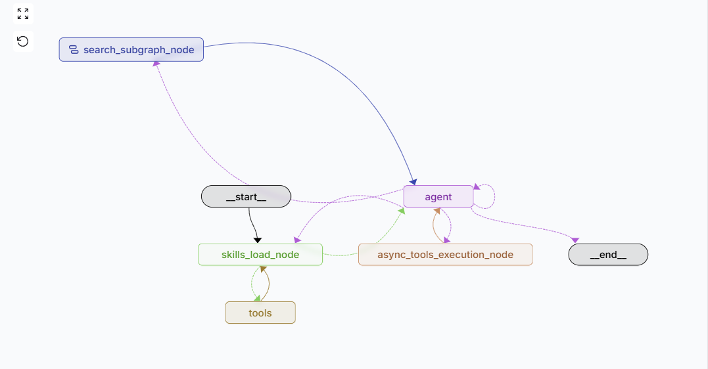
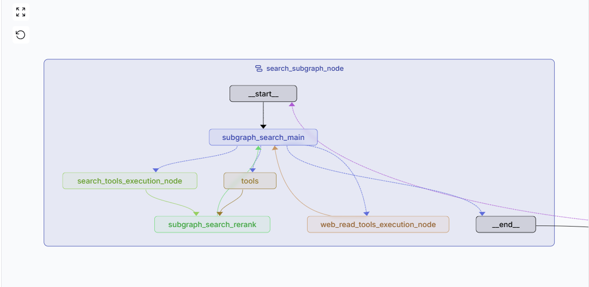
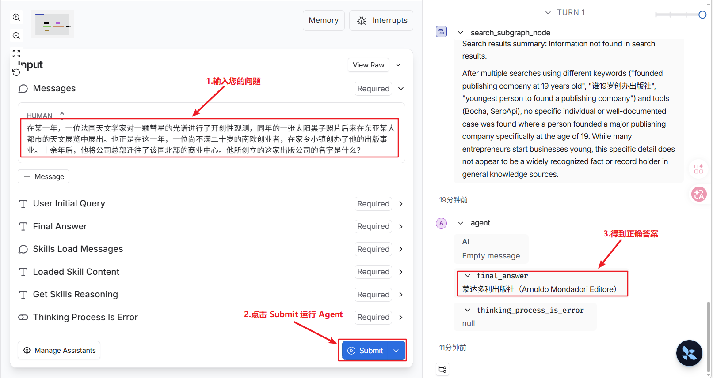

# 🌐 Gaia Research Agent - 企业级多跳搜索与推理智能体

Gaia Research Agent 是一个基于 **LangGraph** 构建的高级研究型智能体（Research Agent）。本项目最初为应对“阿里云 PAI-LangStudio 挑战赛”中严苛的多跳推理、长文本信息验证与零幻觉要求而设计。

与传统的单轮对话或简单的 RAG 系统不同，Gaia 具备**动态技能加载 (S.O.P Routing)**、**嵌套子图搜索循环 (Iterative Search Subgraph)**、**安全的本地代码沙盒**以及**多线程安全的网页缓存**等生产级特性，能够在不微调模型的前提下，通过纯 Agent 工程自主规划并解决极其复杂的真实世界事实考证难题。

## ✨ 核心亮点 (Key Features)

### 1. 🧠 热插拔式动态技能架构 (Pluggable S.O.P Skills)

系统摒弃了传统的“超级大 Prompt”做法，实现了目前最前沿的**“热插拔技能挂载”**机制。开发者只需在特定目录下放入符合规范的 Markdown 文件，系统即可自动解析、加载并赋予 Agent 全新的能力，无需修改任何核心代码逻辑。

- **按需加载**：Agent 首轮会根据用户的查询类型自动扫描技能库，读取 YAML 元数据（如：多跳实体溯源、学术文献检索等），动态加载最匹配的 S.O.P（标准作业程序）。
- **行为约束**：每个 Playbook 包含特定的战术工作流（Tactical Workflow），严格约束大模型的思考路径，极大降低了复杂任务中的幻觉率和逻辑偏离。

**S.O.P 技能文件示例 (`多跳实体溯源.md`)：**
```markdown
---
name: Multi-hop Entity Tracing Playbook
description: Use for complex riddles involving multiple intersecting events, specific people, and institutions...
---
# 🕵️ ROLE & MINDSET
You are an elite Fact-Checker. You do NOT trust your internal memory.
# 🧠 THE S.O.P
### PHASE 1: DECONSTRUCT & PRIORITIZE
Break the user's riddle into strictly independent sub-clues. Make the most unique biographical/business clue your Primary Target.
### PHASE 2: TARGET-FIRST SEARCH & VARIABLE EXTRACTION
Translate your Primary Target into English. Call `search_interface` to find candidate entities and extract the hidden variable (Usually a specific Year).
```


### 2. 🔍 嵌套子图驱动的深度搜索循环 (Iterative Search Subgraph)

构建了独立的 `search_subgraph`，将搜索行为从主脑中解耦，形成闭环的侦察兵机制。

- **Fake Tool Message 状态隔离架构（核心防幻觉机制）**：为了彻底解决长文本搜索导致的 Context 超载，系统首创了“状态隔离”模式。在执行高并发检索时，仅向主脑返回轻量级的 Fake Message（如“执行成功”），而将动辄数万字的原始网页数据引流至独立的全局 State 中进行内部消化。从根本上杜绝了主节点注意力涣散与工具幻觉。

- **多源情报融合**：集成 Bocha（主搜）、SerpApi（Google/Scholar 备用）、Arxiv（数理学术）、PubMed（生物医学）四大检索源。
    
- **自适应降级与滑动窗口精读**：子图内置最大 5 轮的搜索循环。如果浅层 Snippet 无法回答问题，会自动触发 Deep Reading (Jina Reader) 提取完整网页，并对其进行“滑动窗口切片 (800 Token Overlap) + Qwen-Rerank 二次提纯”，有效突破了原生 LLM 的注意力衰减瓶颈。
    
- **内容重排与提纯**：对杂乱的搜索结果进行 MD5 去重，并通过 `Qwen3-rerank` 进行语义重排，提取 Top-N 核心段落反馈给主节点，大幅节省 Token 消耗并提高命中率。
    

### 3. 🛡️ 工业级的工程实现与性能优化

展示了扎实的 Python 后端与并发编程能力：

- **并发工具调用**：在节点（如 `subgraph_search_searchtools_execution_node`）中大量使用 `asyncio.gather`，实现多搜索工具的并发调用，大幅缩短长链路耗时。
    
- **规避并发陷阱的线程安全缓存**：针对高频 URL 抓取，最初尝试手写写优先读写锁，但在压测中敏锐发现 `OrderedDict.move_to_end` 会使 LRU 的 Read 操作转变为 Stateful Write，从而引发潜在的死锁与指针错乱风险。最终果断回退至底层的 `threading.Lock` 互斥锁，以最轻量的方式实现了高吞吐的 LRU 内存网页缓存池。

- **带异常堆栈清洗 (Traceback Clean) 的隔离沙盒**：针对时间计算和规则统计任务，实现了基于 `multiprocessing` 的隔离 Python REPL 工具。除了内置超时强杀与禁用危险包，系统还在底层拦截了 Python 异常栈，精准剔除系统级调用帧，仅将纯净的“开发者逻辑错误”反馈给大模型，极大提升了模型 Self-Debug 的成功率与上下文利用率。
    
- **极致的网页清洗引擎**：针对 Jina 抓取的全量网页，手写了基于正则表达式的高效 Markdown 清洗器 (`clean_web_markdown_content`)，精准剥离维基百科目录、广告、导航栏、多语言尾注等垃圾信息。
    

### 4. 🔄 结构化输出与反思机制 (Reflection & Self-Correction)

- 引入了 **“裁判”机制 (Evaluation System Prompt)**：在输出最终答案前，强制模型审查“是否基于搜索到的证据”、“是否存在推理缺陷”。
    
- **Pydantic 数据契约与严格类型约束**：系统利用 Pydantic Schema 深度结合 LLM 原生的结构化输出能力 (`with_structured_output`)，在底层强制约束了包含 `reasoning`（推理过程）、`is_valid_final_answer`（有效性判定）和 `reasoning_defects`（缺陷分析）的强类型数据契约。彻底规避了传统文本解析 JSON 易导致的格式破损与程序崩溃风险。
    
- 若判定证据不足或逻辑断裂，Agent 会触发 `thinking_process_is_error` 分支，将具体的缺陷反馈给大脑进行重新搜索或重新加载技能，形成完整的自我纠错闭环。


### 5. 📊 性能与极限压测 Benchmark

在面对极端复杂的“海龟汤式”多跳实体溯源难题时（使用 Qwen-3.5-Flash 测试），本架构展现出了显著的工程优化收益：

- **📉 算力成本极限压缩**：得益于 FakeToolMessage 状态隔离机制，单轮极其复杂的多工具查询 Token 消耗从 **100w+ 降至约 20w**（算力成本压缩超 80%），避免了 API 额度熔断。
- **🎯 零幻觉底线与准确率跃升**：在极高难度的推理 Benchmark 中，严格的 S.O.P 约束与反思机制使 Agent 的**完全正确率实现了翻倍（10% 提升至 20%）**。
- **⚡ 网络 I/O 与耗时优化**：依靠底层优化的 LRU 缓存与写优先机制，单轮复杂问答的**平均网络请求从 11 次降至 4 次**，在同等模型下整体端到端耗时**从 610s 缩短至 560s**。
- **📖 深度阅读信噪比提升**：针对超长网页，Jina Reader 结合“滑动窗口切片 (800 Token Overlap) + Qwen-Rerank 二次提纯”，使核心有效段落的获取率**提升约 15%**。
    

---

## 🏗️ 系统架构设计 (Architecture)

系统由 **Main Graph（主脑控制流）** 和 **Search Subgraph（深度搜索子图）** 两部分嵌套协同工作。

### 主图编排 (Main Graph)

主脑负责识别意图、加载技能 S.O.P、调用工具并进行最终的裁判校验。



### 搜索子图循环 (Search Subgraph)

复杂的搜索行为被剥离为子图。工作流：主节点规划搜索词 ➡️ 并发执行各路Search API ➡️ 去重与Qwen Rerank ➡️ 判断是否达成目标（最多循环5次） ➡️ 触发 Jina 深度阅读(如需) ➡️ 汇总证据返回主脑。

**🛡️ 跨图状态通信**：搜索子图与主图实行严格的数据边界隔离。子图在内部独立消化所有的 Raw HTML、异构检索列表与 Rerank 排序数据；最终仅生成一份高度凝练的 Summary（作为 ToolMessage）返回给主脑，确保主脑的上下文窗口绝对纯净且高效。



---

## 💻 核心代码目录解析

Plaintext

```
gaia_search_agent/
├── src/
│   ├── agent.py                 # Graph 的暴露入口
│   ├── app.py                   # FastAPI 接口层，封装 Agent 供外部平台（如 PAI-EAS）进行标准化 HTTP 评测调用
│   ├── graph.py                 # 主图 (Main Graph) 核心编排逻辑
│   ├── llm/                     # LLM 模型与 Rerank 模型初始化
│   ├── node/                    # 所有的执行节点 (Node)
│   ├── route/                   # 条件边路由逻辑 (Conditional Edges)
│   ├── schemas/                 # Pydantic 结构化输出定义
│   ├── skills/                  # S.O.P 技能库 (Markdown)
│   ├── state/                   # 跨节点流转的状态定义
│   ├── subgraph/                # 搜索子图的定义
│   ├── tools/                   # 具体的外部工具集成 (Arxiv, Bocha, Jina, REPL 等)
│   └── utils/                   # 核心工程组件库 🔧
│       ├── WritePriorityRWLock.py  # 自定义写优先读写锁
│       ├── web_pages_cache.py      # LRU 网页内存缓存
│       ├── web_content_clean.py    # Markdown 垃圾清洗器
│       ├── web_paginate.py         # 长文本重叠分块与重排机制
│       └── qwen_rerank.py          # Qwen-Rerank 接口调用
├── .env.example                 # 环境变量模板
├── langgraph.json               # LangGraph CLI 配置文件
└── requirements.txt
```

---

## 🛠️ 技术栈 (Tech Stack)

- **AI 框架**: LangGraph 1.0, LangChain Core
    
- **大语言模型**: 通义千问 (qwen3.5-flash、qwen3.5-plus、qwen-plus、qwen-max等) 驱动逻辑规划，Qwen3-Rerank 驱动语义重排。
    
- **搜索与数据源**: Bocha API (主搜), SerpApi (备用), Arxiv & PubMed (专业文献), Jina Reader (深度网页抓取)。
    
- **后端框架**: FastAPI, Uvicorn (异步非阻塞支持)
    
- **工程组件**: `asyncio` (并发控制), `multiprocessing` (代码沙盒), 自定义 `RWLock` (读写锁并发控制)。
    

---

## 🚀 快速开始 (Quick Start)

### 1. 环境准备

Bash

```
# 克隆仓库
git clone https://github.com/wangjing1224/gaia_search_agent.git
cd gaia_search_agent

# 安装依赖
pip install -r requirements.txt
```

### 2. 配置环境变量

复制 `.env.example` 为 `.env`，填入所需的 API Keys：

代码段

```
DASHSCOPE_API_KEY=your_dashscope_key
BOCHA_API_KEY=your_bocha_key
SERPAPI_API_KEY=your_serpapi_key
JINA_API_KEY=your_jina_key
PUBMED_API_KEY=your_pumbed_key
PUBMED_EMAIL=your_email
LANGSMITH_TRACING=true
LANGSMITH_API_KEY=your_langsmith_key
```

### 3. 启动可视化调试 UI 

本项目原生支持 **LangGraph Studio**。这是测试和观测多跳 Agent 最佳的方式，你可以直观地看到每个节点的触发、子图的嵌套循环以及跨节点的状态（State）流转。

**👉 运行以下命令启动本地开发服务器与可视化 UI：**

Bash

```
# 确保你已经安装了 langgraph-cli
langgraph dev
```

执行后，终端会输出一个 Web UI 链接（通常为 `http://localhost:2024`）。在浏览器中打开，即可进入 LangGraph Studio 界面，输入你的测试问题并实时观察 Agent 的思考路径。



---

## 💡 典型工作流展示：解决多跳海龟汤难题

在测试中，面对类似于“_在某一年，一位法国天文学家对一颗彗星的光谱进行了开创性观测...同年，一位尚不满二十岁的南欧创业者创办了出版事业，十余年后将总部迁往北部商业中心。他创立的这家出版公司叫什么？_”这种“海龟汤”式的变态推理题，单次 Search 命中率几乎为零。Gaia Agent 的核心价值不在于暴力猜答案，而是通过 LangGraph Studio 展现了一个**极其严谨、可观测、抗幻觉的机器思考过程**：

1. **🕵️ 动态策略路由 (S.O.P Routing)** Agent 识别任务类型后，动态加载 SOP。SOP 强制大模型不盲目搜索，而是提取最具唯一性的线索（不满二十岁的南欧出版商），并自主翻译为英文进行靶向检索，精准锁定关键年份（1907年）与候选人（Arnoldo Mondadori）。
    
2. **🔄 交叉验证闭环 (Cross-Verification)** 拿到 1907 年后，Agent 根据 SOP 要求进行严苛的交叉验证。它将 1907 年代入“法国天文学家观测彗星光谱”进行检索，发现证据链完美闭环，从而彻底打碎大模型的“幻觉”倾向。
    
3. **🛡️ 零幻觉底线与优雅降级 (Graceful Degradation)** 当检索到的证据链断裂，或者大模型擅自“脑补”连接时，系统的**裁判 (Evaluation)** 会立即判定 `is_valid_final_answer = False`。系统将错误详情与逻辑断点反投给主脑触发重试。这种**过程完全白盒化、坚决不产生幻觉**的工程架构，极大提升了复杂业务落地时的可控性。